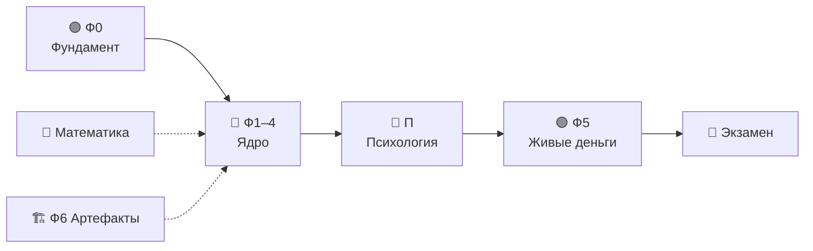

# 🚀 КриптоНавигатор

> **Интерактивный тренажёр, который превращает новичка в дисциплинированного оператора торгового бота — без единой строчки кода и без риска реальными деньгами.**

Это не курс «смотри и слушай». Это **одностраничное приложение-симулятор** (`index.html`, чистый HTML/CSS/JS, ноль установки, ноль фреймворков), где ты с самого начала *делаешь*: кликаешь, считаешь, ошибаешься в безопасной песочнице, проходишь аттестации и выращиваешь привычки, которые потом удержат тебя от дорогих ошибок на живом рынке.

---

## 🎯 Для кого

- **Абсолютный новичок**, который слышал про крипту, но не знает, с какой стороны подойти.
- **Самоучка**, который уже «торговал руками» и слил — и хочет понять *почему*.
- **Будущий оператор бота**, который хочет, чтобы машина работала, а он — спал.

Не для тех, кто ищет «сигналы» и «+400% за неделю». Здесь учат *не терять*, прежде чем учить зарабатывать.

---

## 📊 Курс в цифрах

| | |
|---|---|
| 📚 **Уроков** | **134** (60 основных + 22 бонусных + 44 математики + 8 психологии) |
| 🗺️ **Фаз обучения** | **9** (0–6 + Математика + Психология) |
| 🧩 **Интерактивных виджетов** | **145** встроенных в уроки |
| 🏗️ **Тренажёров «Конструктор артефактов»** | **8** (создай токен, стейблкоин, NFT, бота и др.) |
| 🌍 **Живой рынок с наставником** | 6 источников данных, 12 детекторов объяснений |
| 📰 **Новости-наставник** | 5 RSS-лент, классификатор 7 типов, 3 упражнения |
| 🧠 **Психотренажёров** | **8** (по одному на урок П1–П8) |
| 📖 **Терминов в глоссарии** | **205** |
| ✅ **Аттестаций** | по каждой фазе (порог 80%) |
| 🎮 **Мини-игр** | **21** (18 игровых тренажёров + 3 отдельные игры) |
| 📦 **Размер** | один файл, ~2,6 МБ, работает офлайн после первой загрузки |

---

## 🗺️ Программа: 9 фаз от «что такое деньги» до «я управляю системой»

Каждая фаза — это набор уроков с квизами, симуляторами и обязательной аттестацией. Прогресс сохраняется в браузере.



### 🟣 Фаза 0 — Фундамент (20 уроков)
Финансовая грамотность *до* трейдинга: что такое актив, риск, волатильность, почему «руки» проигрывают системе. Без этого дальше нельзя.

### 🔵 Фазы 1–4 — Ядро (33 урока)
Рынок, инструменты, риск-менеджмент, психология исполнения. Здесь живут основные симуляторы: от стакана и ликвидаций до дельта-нейтральных стратегий и эквити-кривых.

### 🟢 Фаза 5 — Система (7 уроков)
Собираешь всё в рабочую торговую систему: правила, устав, бэктест, журнал.

### 🏗️ Фаза 6 — Бонус-модуль (22 урока)
Артефакты криптоэкосистемы изнутри: токены, стейблкоины, NFT, DAO, оракулы. Здесь живут **8 тренажёров «Конструктор артефактов»** — ты *создаёшь* объект рынка и наблюдаешь его судьбу.

### 🧮 Фаза М — Математика (44 урока)
Вероятность, матожидание, дисперсия, тестирование гипотез, переобучение — без страшных формул, на пальцах и ползунках.

### 🧠 Фаза П — Психология оператора бота (8 уроков П1–П8)
Главный риск любой системы — её владелец. Отдельный блок про то, как не мешать машине работать:
- когда **можно** трогать бота (а когда — только кажется, что можно);
- **головокружение от успехов** и якорь «хоть бы в ноль»;
- гигиена сна и рынок 24/7;
- тяга к движению и «чужие голы»;
- **«Письмо из будущего»** — разбор собственной катастрофы до её начала.

---

## 🧪 Методики обучения (почему это запоминается)

Курс построен на доказательных когнитивных техниках — не на «прочитал и забыл».

| Методика | Как реализовано |
|---|---|
| 🔄 **Интерливинг** | Смешанные сессии вопросов из разных фаз — мозг учится различать, а не зубрить по порядку |
| 🧘 **Консолидация NSDR** | После каждого урока — экран «тишины» с таймером и дыханием 4-4-6: мозг «прописывает» изученное |
| 🗣️ **Метод Фейнмана** | Объясни концепцию своими словами — с фильтром слов-паразитов |
| 🎯 **Active Recall 2.0** | Числовые вопросы с открытым вводом (не «угадай из четырёх») |
| 📈 **Brier-калибровка** | Прогнозы с самооценкой уверенности — учишься отделять «знаю» от «кажется» |
| 📓 **Журнал когнитивных ошибок** | Твои собственные повторяющиеся ловушки — в одном месте |
| 🧩 **SM-2 (интервальные повторения)** | «Сборочный пункт» после каждых 5 уроков |
| 🔀 **Перемешивание ответов** | Все квизы шаффлятся детерминированным ГСЧ — нельзя вызубрить позицию правильного ответа |

---

## 🌍 Живой рынок с наставником

Новая вкладка-лаборатория: реальные рыночные данные + детекторы, которые объясняют каждое число. Не сигналы — обучение чтению рынка.

- **6 источников без ключей**: страх/жадность, CoinGecko, комиссии BTC (mempool.space), стакан/свечи/фандинг OKX. Кэш последнего снимка → урок никогда не ломается; полный офлайн через 🧪 учебные данные.
- **12 детерминированных детекторов** (спред, дисбаланс, стены, свежесть, тело/тени, объём, индекс, смена зоны, комиссии, фандинг, доминация) — одни и те же данные дают одно и то же объяснение.
- **Уровни А/Б/В** в каждой карточке: «Где смотреть» (с подсветкой) → «Что это значит» → «Чего это НЕ значит».
- **Режим «Сначала подумай»**: ответ + слайдер уверенности → эталонная карточка; ответы копятся в Brier-калибровку.
- **Кнопки 🌍 в 9 уроках** после их прохождения; задания по живым данным с допуском ±20%.
- Опциональный Cloudflare Worker (worker/live-proxy.js): wrangler deploy, затем в консоли приложения: localStorage.setItem('cn_live_api_base', 'https://…workers.dev'). Без воркера работает прямой режим — CORS у источников открыт.

## 📰 Новости как учебный материал

Субвкладка внутри «Живого рынка»: реальная лента крипто-новостей — и наставник, который разбирает каждую: о чём она на самом деле, на что давит механически, чего сознательно не говорит. Не сигналы — обучение чтению информационного потока.

- **5 RSS-источников** (ForkLog, BeInCrypto RU, CoinDesk, Decrypt, SEC) через rss2json или воркер; атрибуция на каждой карточке; кэш снимка → офлайн-откат.
- **Классификатор 7 типов** (регуляторное, безопасность, макро, технологии, рынок капитала, хайп, скам-маркеры) на взвешенных словарях + наивный Байес, который учится на твоих подтверждениях. Точность 92.8% на корпусе.
- **Карточки из заготовок, написанных человеком**: «Механика» и «Чего не говорит» — никаких фактов «из воздуха».
- **3 упражнения**: «Угадай тип» (точность по типам — карта слепых зон), «История знает ответ» (10 архивных кейсов: FTX, ETF, UST-depeg, халвинг… → Brier-калибровка), «Анти-FUD» (пары заголовков: эмоция против фактов).
- **Гейтинг**: лента открывается после уроков 2.1–2.2, «Анти-FUD» — после 0.18; **таймер внимания**: 10 минут ленты → карточка «тяга к движению».

## 🤖 AI-Наставник М. (тариф Макс)

AI-разбор материала урока: только текст текущего урока, без прогнозов и рекомендаций. Реальная модель живёт на воркере Workers AI (опционален; фронт работает и в absence — демо-режим с честным баннером).

- **F1 Проверка Фейнмана**: объяснение ученика → JSON-вердикт understood|partial|missed → cn_feynman_ai
- **F2 Объясни иначе**: Проще/Пример/Короче (без добавления фактов)
- **F3 Сократов**: 3 ступени встречных вопросов → итог из материала
- **F4 Генератор задач**: модель оформляет условие, КОД считает эталон
- **H1 «Подскажи»** в каждом виджете: 3 ступени, счётчик cn_hints ≤2 для бейджа
- **H2 Критик гипотезы** (5 измерений: ok|warn|fail), **H3 Ревизор устава** (словарный скан кодом)
- **H4 Диагноз ошибки** (trap_type предвыбор), **H5 Стальман-спарринг** (3 стадии)
- Лимит 30 действий/день (пул по всем 7 фичам); фильтр «цена вырастет/покупай»

### Улучшения UX (v1.1)
- **Тон ошибок**: offline/limit/error — честные сообщения без «задумался»
- **Демо-режим**: предупреждение «ответы примитивные без настройки воркера»
- **Кнопка «Ещё раз»** после не-JSON/ошибки
- **История диалога**: Socratic получает последние 3 действия в контекст
- **Адаптивный лимит**: 20 базовый +10 за пройденный урок +5 за активность без подсказок
- **Кэш ответов**: TTL 1 час по (lesson+action+payload)
- **Персонализация**: сложные детекторы (stable_lab, bot_assembler) отстают до уровня


## 🕹️ Интерактив и геймификация

Скучно не будет — но азарт здесь под контролем (этому тоже учат).

- **145 интерактивных виджетов** внутри уроков: стакан, ликвидации (с gauge «расстояние до ликвидации»), funding drag, transaction cost, DeFi yield, эквити-кривые, карта корреляций, конструктор дельта-нейтрала, сэндвич-атака MEV и другие.
- **8 тренажёров «Конструктор артефактов»**: ты не только изучаешь объекты рынка — ты их *создаёшь* в песочнице и смотришь на последствия: запусти свой токен за пять шагов, создай мемкоин в три клика, удержи стейблкоин под набегом, выпусти и продай NFT, проголосуй в DAO, проверь, врёт ли оракул, собери торгового бота (выпускной экзамен), управляй токенизированным фондом год.
- **8 психотренажёров**: «Тревога в 03:00», «Качели доверия», «Зелёная полоса», «Магия нуля», «Радионяня трейдера», «Детектор тяги», «Письмо из будущего», «Судья недель».
- **21 мини-игра**: 18 игровых тренажёров (гонка блоков, коридор ликвидаций, жирные хвосты, веер Келли, лента коинтеграции, шторм корреляций, ASIC под напряжением, стейкинг, IL, payoff и др.) + 3 отдельные игры — «Защити seed-фразу», «Угадай режим рынка», «Спаси депозит».
- **Боссы-дуэли, ранги, бейджи, спидраны, стрики** — прогресс виден и ощутим.
- **Помодоро-таймер 25 мин** (opt-in) — чтобы не залипать.

---

## 🧠 Блок «Психология» — отдельная гордость

8 уроков и 8 тренажёров про самое слабое звено любой торговой системы — человека за экраном. Размещён методически точно: **после того, как система собрана, до того, как в неё идут живые деньги**.

Кульминация — **«Письмо из будущего»**: ты письменно описываешь, как через год потерял капитал, и к каждой причине ставишь предохранитель. Письмо сохраняется и перечитывается ежеквартально. Это документ №2 по важности после устава.

---

## 🛠️ Технически

- **Один файл** `index.html` — никаких сборок, npm, серверов.
- **Ванильный JS** — без фреймворков, читаемый код.
- **Тёмная тема**, полностью на русском, адаптив (включая мобильный 360px).
- **Весь прогресс локально** (`localStorage`) — ничего не отправляется наружу.
- **Детерминированные ГСЧ** — тренажёры воспроизводимы.

### Запуск
Просто открой `index.html` в браузере. Всё. Для корректной работы некоторых функций лучше через локальный сервер:

```bash
python3 -m http.server 8000
# → http://localhost:8000/index.html
```

---

## ⚠️ Дисклеймер

Это **учебный** тренажёр. Все симуляции — на виртуальных данных. Ничто здесь не является финансовым советом. Реальная торговля несёт риск потери капитала. Курс учит *процессу и дисциплине*, а не обещает прибыль.

---

## 📸 Скриншоты

| | |
|---|---|
|  |  |
| **Главный экран** | **Дорожная карта** |
|  |  |
| **Урок в полноэкранном режиме** | **Симулятор** |
|  |  |
| **Психотренажёр «Тревога в 03:00»** | **Викторина** |
|  |  |
| **Глоссарий — 205 терминов** | **Мобильный вид** |

**Демо тренажёра** — прохождение «Тревога в 03:00»:


---

**Готов перестать быть пассажиром собственных денег? Открывай `index.html` — Фаза 0 ждёт.** 🚀
