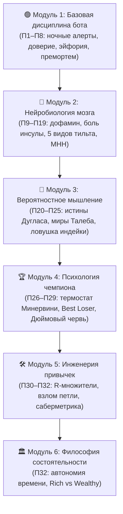

# 🚀 КриптоНавигатор

> **Интерактивный тренажёр и обучающая экосистема, которая превращает новичка в дисциплинированного оператора торгового бота и квант-исследователя — без единой строчки кода и без риска реальными деньгами.**

Это не курс «смотри и слушай». Это **автономное приложение-симулятор** (`index.html`, чистый HTML/CSS/JS, ноль установки, ноль сторонних фреймворков), где ты с самого начала *делаешь*: кликаешь, рассчитываешь риски, ошибаешься в безопасной песочнице, проходишь квалификационные аттестации и выращиваешь привычки, которые удержат тебя от дорогих ошибок на живом рынке.

---

## 🎯 Для кого

- **Абсолютный новичок**, который хочет безопасно разобраться в криптовалютах, блокчейне и алгоритмическом трейдинге.
- **Самоучка**, который уже «торговал руками», испытал эмоциональные срывы или слил депозит — и хочет понять *почему* и как выстроить систему.
- **Будущий оператор торгового бота**, который хочет, чтобы машина работала по жесткому регламенту, а он — спокойно спал.

Не для тех, кто ищет «сигналы» и «+400% за неделю». Здесь учат **не терять капитал**, мыслить вероятностями и математическим ожиданием, прежде чем выходить на реальный рынок.

---

## 📊 Курс в цифрах

| Метрика | Значение |
|---|---|
| 📚 **Всего уроков** | **166** (60 основных + 22 бонусных + 44 математики + **40 психологии и риск-инженерии**) |
| 🗺️ **Фаз обучения** | **9** (Фазы 0–6 + Фаза М (Математика) + **Фаза П (Психология)**) |
| 🧩 **Интерактивных виджетов и симуляторов** | **177** встроенных в уроки (включая Монте-Карло, стакан, ликвидации, дельта-нейтрал) |
| 🧠 **Психологических тренажёров** | **40** интерактивных тренажёров (по одному на каждый урок П1–П40) |
| ❓ **Банк ситуационных тестов самопроверки** | **120** гарвардских бизнес-кейсов (по 3 на каждый урок П1–П40) |
| 🏗️ **Конструкторов рыночных артефактов** | **8** (создай токен, стейблкоин, NFT, DAO, оракул, торгового бота и др.) |
| 🌍 **Живой рынок с наставником** | 6 источников данных, 12 детерминированных детекторов |
| 📰 **Новости-наставник** | 5 RSS-лент, классификатор 7 типов, 3 когнитивных упражнения |
| 📖 **Терминов в глоссарии** | **205** с примерами и жизненными аналогиями |
| 🏆 **Квалификационных аттестаций** | **9** (по каждой фазе с порогом 80%) |
| 🎮 **Мини-игр и тренажеров** | **21** (18 игровых симуляторов + 3 отдельные игры) |
| 📦 **Автономность** | Один файл `index.html`, работает 100% офлайн без интернета |
| ☁️ **SaaS-платформа** | Cloudflare Workers API + KV + R2 контент-паки с Brotli-сжатием |

---

## 🗺️ Программа: 9 фаз от «что такое деньги» до «я управляю капиталом»

Каждая фаза — это структурированный набор уроков с квизами, практическими симуляторами и обязательной аттестацией. Прогресс сохраняется в браузере и синхронизируется с облаком.


### 🟣 Фаза 0 — Фундамент финансовой грамотности (20 уроков)
База до трейдинга: природа денег, инфляция, риск и доходность, блокчейн, почему ручной трейдинг проигрывает системе, устройство бирж и кошельков.

### 🔵 Фазы 1–4 — Ядро количественного трейдинга (33 урока)
- **Фаза 1:** Research Pipeline, стационарность рядов, толстые хвосты, Look-ahead bias, Walk-Forward анализ.
- **Фаза 2:** Поиск статистического эджа, ончейн-аналитика, стакан заявок (OBI, CVD, спуфинг), воронка квант-исследований.
- **Фаза 3:** Портфельная теория, коинтеграция, парный арбитраж, риск-менеджмент, формула Келли и Value at Risk.
- **Фаза 4:** Инфраструктура, WebSockets, архитектура торгового бота, P2P, налоги и соблюдение 115-ФЗ.

### 🟢 Фаза 5 — Система и живой капитал (7 уроков)
Сборка системы воедино: торговый устав, бэктест, журнал сделок, запуск на реальные средства и регулярный аудит.

### 🏗️ Фаза 6 — Конструктор крипто-артефактов (22 урока)
Внутренняя механика Web3: токены, алгоритмические стейблкоины, NFT, механизмы голосования DAO, децентрализованные оракулы. Включает 8 интерактивных конструкторов.

### 🧮 Фаза М — Математика и теория вероятностей (44 урока)
Матожидание, дисперсия, распределение Гаусса против степенных законов, байесовское обновление вероятностей, симуляции Монте-Карло — наглядные ползунки без сложных академических формул.

---

## 🧠 Фаза П — Академия психологии и риск-инженерии (40 уроков, П1–П40)

Главный риск любой системы — её владелец. Этот блок объединяет 8 базовых уроков управления ботом и 32 урока по идеям и методикам из **14 фундаментальных мировых бестселлеров** по психологии трейдинга, нейроэкономике и науке о рисках (*Jared Tendler, Tom Hougaard, Mark Douglas, Mark Minervini, Brett Steenbarger, Nassim Taleb, David Spiegelhalter, Morgan Housel, Daniel Crosby, Gary Edward, Jason Zweig, Jack Schwager, Brett Goldstein, Александр Могилат*).

Блок состоит из **6 специализированных модулей**, **40 интерактивных тренажеров** и **120 ситуационных задач самопроверки**:



### 📋 Содержание модулей Академии психологии:

1. **Модуль 1. Базовая дисциплина и управление ботом (Уроки П1–П8):**
   - П1. Сломался или просто страшно? Когда можно трогать бота *(Тренажер: Фильтр ночных тревог)*
   - П2. Доверяй машине, но стой рядом: две крайние ошибки *(Тренажер: Шкала доверия)*
   - П3. Головокружение от успехов: удар после серии побед *(Тренажер: Симулятор отката Giveback)*
   - П4. Ловушка «хоть бы вернуть своё»: якорь на нуле *(Тренажер: Калькулятор асимметрии просадки)*
   - П5. Ночная смена: сон, телефон и рынок 24/7 *(Тренажер: Белый список ночных алертов)*
   - П6. Качели как сахар: тяга к движению и чужие голы *(Тренажер: Детектор дофаминового зуда)*
   - П7. Письмо из будущего: разбор катастрофы до её начала *(Тренажер: Конструктор Pre-Mortem)*
   - П8. Судьи считают технику, а не один гол *(Тренажер: Судья торговых недель)*

2. **Модуль 2. Нейробиология мозга и анатомия эмоций (Уроки П9–П19):**
   - П9. Дофаминовый капкан: почему предвкушение слаще денег *(Тренажер: Холодный таймер 15 мин)*
   - П10. Боль фиксации убытка: островковая доля мозга и неприятие потерь *(Тренажер: Ментальное списание)*
   - П11. Гормональный шторм: захват миндалины на обвале *(Тренажер: Антипаническое дыхание 4-4-6)*
   - П12. Ментальный капитал: истощение префронтальной коры *(Тренажер: Батарея ментальной энергии)*
   - П13. Физиология спокойствия: блуждающий нерв и сброс стресса *(Тренажер: Сброс телесных зажимов)*
   - П14. Паутина тильта: почему месть рынку гарантирует слив *(Тренажер: Аварийный стоп-тильт)*
   - П15. Пять лиц злости: классификация тильта по Тендлеру *(Тренажер: Детектор масок тильта)*
   - П16. Четыре формы страха: паралич кнопки и синдром FOMO *(Тренажер: Шкала страха входа)*
   - П17. Жадность и переторговка: почему больше сделок значит меньше денег *(Тренажер: Снайпер vs Пулеметчик)*
   - П18. Протокол MHH: 5 шагов ментального ремонта по Тендлеру *(Тренажер: Интерактивный бланк MHH)*
   - П19. Накопленная эмоция: вечерний дебрифинг и защита следующего дня *(Тренажер: Декомпрессия стресса)*

3. **Модуль 3. Вероятностное мышление и наука о риске (Уроки П20–П25):**
   - П20. Пять истин Дугласа: как мыслить как владелец казино *(Тренажер: Симулятор 100 000 спинов рулетки)*
   - П21. Истинное принятие риска: как перестать мучиться внутри сделки *(Тренажер: Детектор принятия риска)*
   - П22. Альтернативные истории Талеба: почему выигрыш не делает мастером *(Тренажер: Веер 100 миров Талеба)*
   - П23. Ошибка выжившего: почему нельзя верить чужим скриншотам *(Тренажер: 10 000 бросающих монеты обезьян)*
   - П24. Ловушка индейки: почему 100% винрейт в мартингейле обнуляет счет *(Тренажер: День благодарения)*
   - П25. Правило Кромвеля: байесовское мышление и калибровка Brier Score *(Тренажер: Калибратор Brier Score)*

4. **Модуль 4. Психология чемпиона и безупречное исполнение (Уроки П26–П29):**
   - П26. Ментальный термостат: почему подсознание сливает выросший депозит *(Тренажер: Термостат Минервини)*
   - П27. Парадокс лучшего неудачника: инверсия Хоугаарда «Best Loser Wins» *(Тренажер: Асимметрия выплат 3:1)*
   - П28. Ясность важнее уверенности: как действовать без сомнений *(Тренажер: 3 вопроса Чек-листа Ясности)*
   - П29. Модель Дюймового червя: ликвидация C-game по Тендлеру *(Тренажер: Подтягивание хвоста мастерства)*

5. **Модуль 5. Инженерия привычек и саберметрика (Уроки П30–П32):**
   - П30. Мышление в R-множителях: как отключить денежный гипноз *(Тренажер: Тумблер Рубли ↔ R-риски)*
   - П31. Взлом петли привычки: метод перепрошивки реакций Алана Эдварда *(Тренажер: Замена действия петли)*
   - П32. Саберметрика трейдинга и покупка свободы времени *(Тренажер: Калькулятор покупки свободы Хаузела)*

---

## 🧪 Доказательные методики обучения

| Методика | Реализация в тренажёре |
|---|---|
| 🔄 **Интерливинг** | Смешанные сессии вопросов из разных фаз — тренируют распознавание рыночных паттернов |
| 🧘 **Консолидация NSDR** | Экран «тишины» после каждого урока с таймером и дыханием 4-4-6 для фиксации нейропластичности |
| 🗣️ **Метод Фейнмана** | Формулирование концепций своими словами с алгоритмической проверкой понятий |
| 🎯 **Active Recall 2.0** | Числовые и ситуационные задачи с открытым вводом и допуском точности |
| 📈 **Brier-калибровка** | Самооценка степени уверенности с расчетом Brier Score — разделяет знание от иллюзии |
| 📓 **Журнал когнитивных ошибок** | Фиксация персональных поведенческих ловушек в одном месте |
| 🧩 **SM-2 интервальные повторения** | Контрольные сборочные пункты каждые 5 уроков |
| 🔀 **Детерминированное перемешивание** | Варианты ответов перемешиваются ГСЧ — невозможно вызубрить позицию ответа |

---

## 🕹️ Квант-викторина и тесты самопроверки

В платформу встроен тренажер самопроверки с 6 специализированными режимами:
1. `⚡ Блиц по терминам` — скоростная проверка понятийного аппарата (205 терминов).
2. `🧠 Практические квант-кейсы` — решение прикладных задач алготрейдинга и бэктестинга.
3. `⚖️ Законы, 115-ФЗ и Налоги` — проверка юридической и налоговой безопасности.
4. `🧮 Расчётные задачи` — вычисление Келли, матожидания, плеча, комиссионного трения.
5. `📊 Гипотезы из данных` — проверка на переобучение, стационарность и утечки данных.
6. `🧘 Психология и риск-контроль (120 кейсов)` — решение глубоких психологических кейсов по всем 40 урокам Фазы П.

---

## 🛠️ Запуск и техническое устройство

### Локальная автономная версия (`index.html`)
- **Один файл** — никаких внешних зависимостей, npm-пакетов или серверов.
- **Чистый JavaScript** — нативный браузерный стек, адаптивный дизайн для ПК и смартфонов.
- **100% приватность** — все данные и прогресс сохраняются в локальном `localStorage` браузера.

Запуск в один клик: просто откройте `index.html` в браузере (Chrome, Edge, Firefox, Safari) или поднимите локальный сервер:
```bash
python -m http.server 8000
# → http://localhost:8000/index.html
```

### SaaS-платформа на Cloudflare Workers (`saas/`)
- Беспарольная аутентификация по Magic Link / JWT.
- Автоматическая двусторонняя синхронизация прогресса с локальным хранилищем.
- Модульный контент-конвейер: контент автоматически экстрагируется в оптимизированные Brotli-паки (до 48.7 КБ) и распределяется через Cloudflare R2 и KV без необходимости передеплоя воркера.

---

## ⚠️ Дисклеймер

Платформа «КриптоНавигатор» является **образовательным тренажёром**. Все симуляции, расчеты и упражнения выполняются на учебных виртуальных данных. Материалы платформы не являются индивидуальной инвестиционной или финансовой рекомендацией. Реальная торговля сопряжена с высоким риском потери капитала. Курс учит **культуре риска, дисциплине и инженерному процессу**.

---

**Готов перестать быть пассажиром собственных денег? Открывай `index.html` — Фаза 0 и Академия психологии ждут.** 🚀
