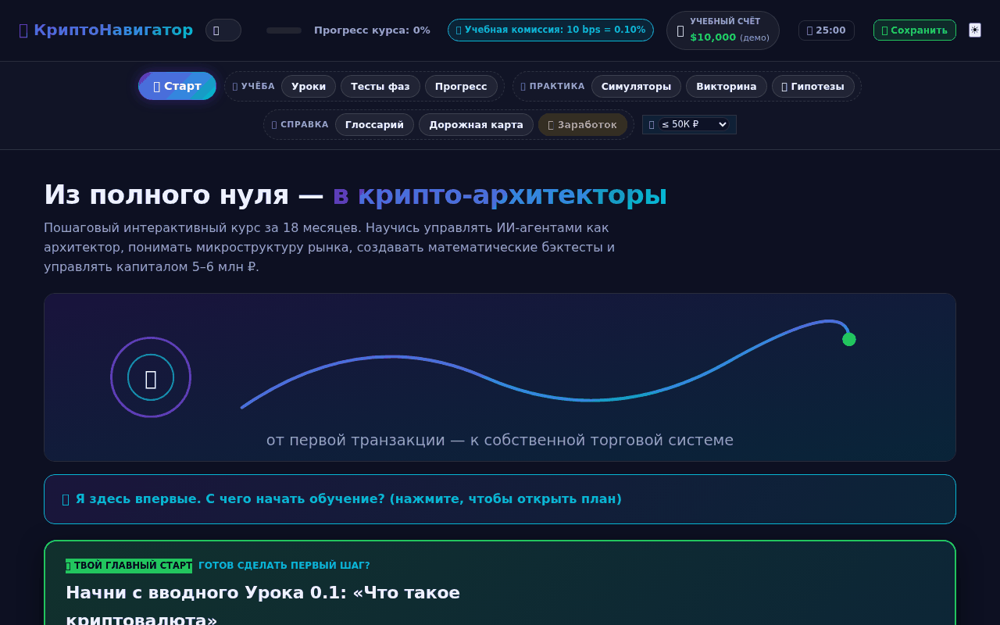
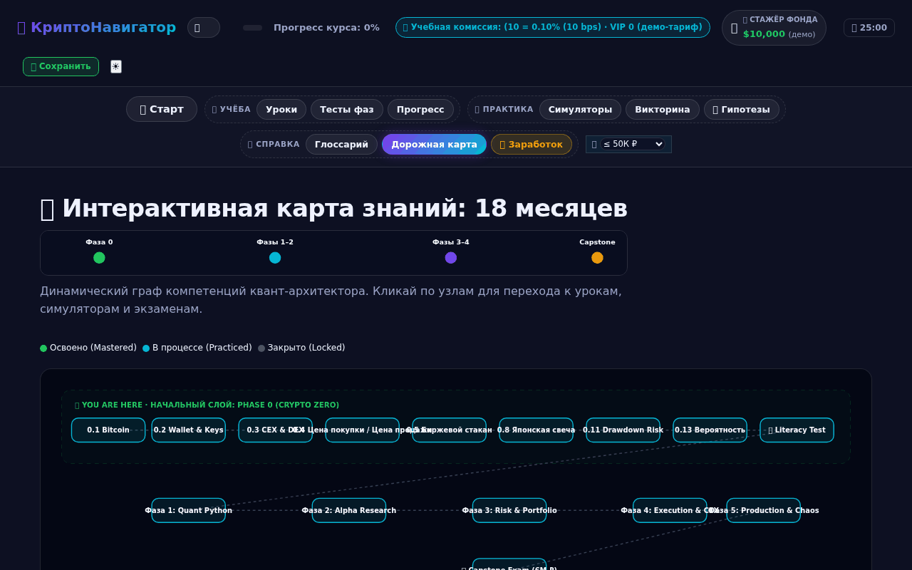
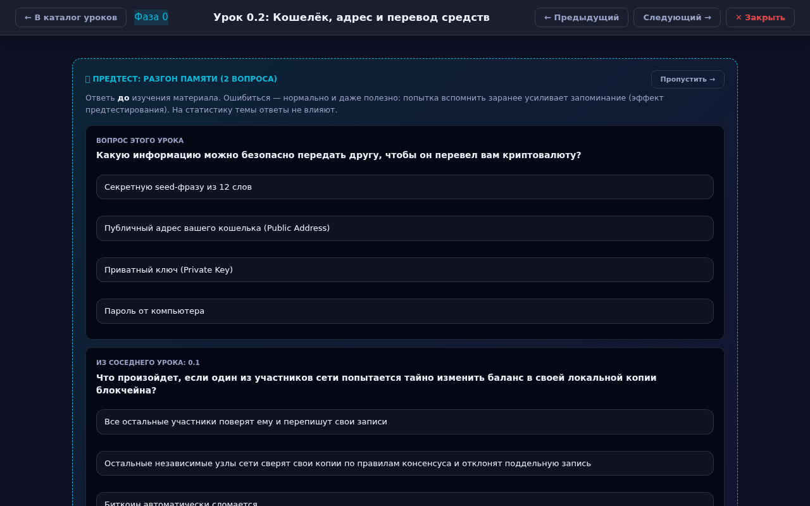
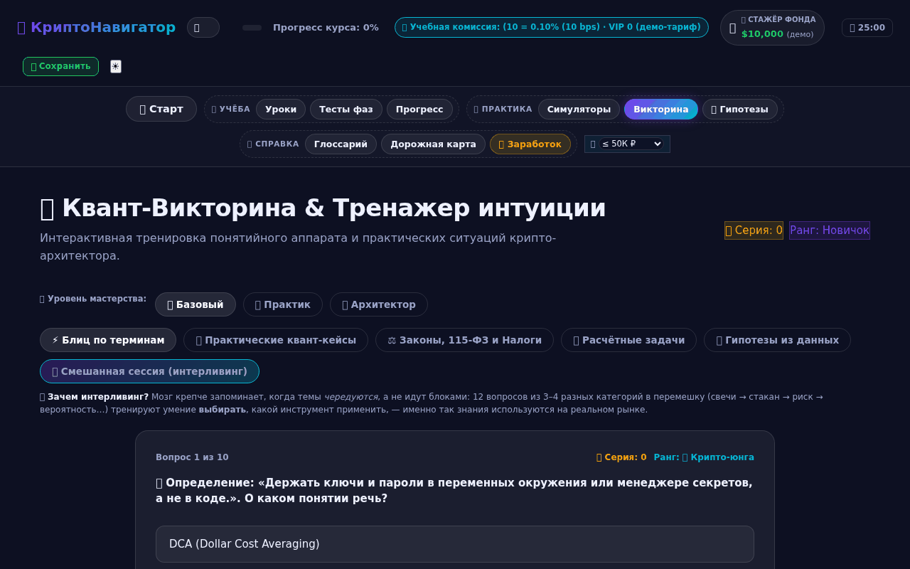
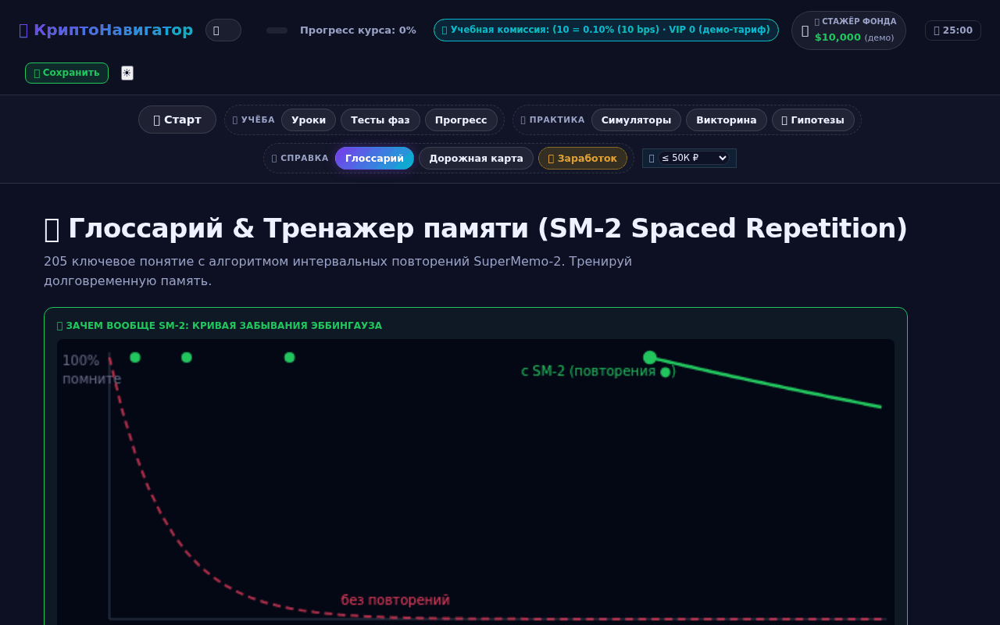
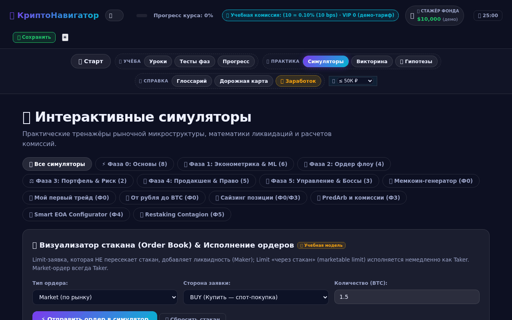
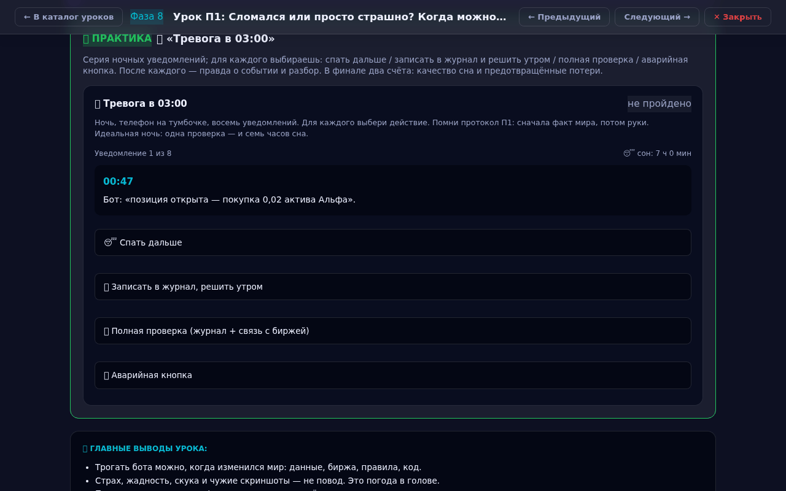
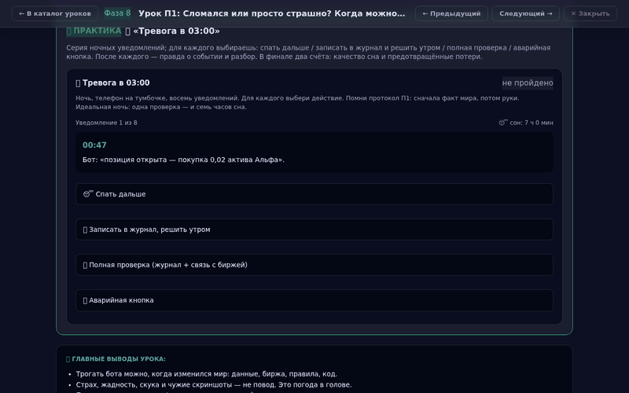
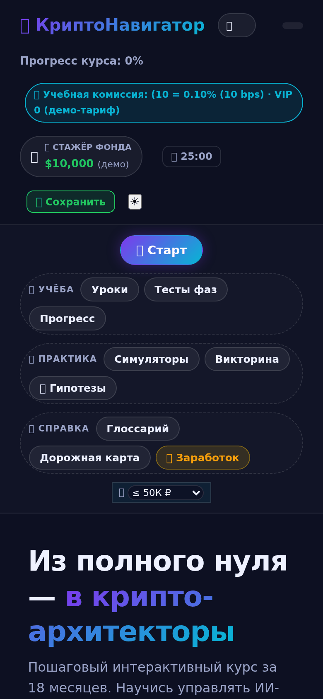

# 🚀 КриптоНавигатор

> **Интерактивный тренажёр, который превращает новичка в дисциплинированного оператора торгового бота — без единой строчки кода и без риска реальными деньгами.**

Это не курс «смотри и слушай». Это **одностраничное приложение-симулятор** (`index.html`, чистый HTML/CSS/JS, ноль установки, ноль фреймворков), где ты с самого начала *делаешь*: кликаешь, считаешь, ошибаешься в безопасной песочнице, проходишь аттестации и выращиваешь привычки, которые потом удержат тебя от дорогих ошибок на живом рынке.



---

## 🎯 Для кого

- **Абсолютный новичок**, который слышал про крипту, но не знает, с какой стороны подойти.
- **Самоучка**, который уже «торговал руками» и слил — и хочет понять *почему*.
- **Будущий оператор бота**, который хочет, чтобы машина работала, а он — спал.

Не для тех, кто ищет «сигналы» и «+400% за неделю». Здесь учат *не терять*, прежде чем учить зарабатывать.

---

## 📊 Курс в цифрах

| | |
|---|---|
| 📚 **Уроков** | **131** (73 базовых + 8 психологии + модули) |
| 🗺️ **Фаз обучения** | **7** (Фаза 0–5 + Фаза П «Психология») |
| 🧩 **Симуляторов** | **43** интерактивных |
| 🧠 **Психотренажёров** | **8** (по одному на урок П1–П8) |
| 📖 **Терминов в глоссарии** | **205** |
| ✅ **Аттестаций** | по каждой фазе (порог 80%) |
| 🎮 **Мини-игр** | «Защити seed-фразу», «Угадай режим рынка», «Спаси депозит» и др. |
| 📦 **Размер** | один файл, ~2 МБ, работает офлайн после первой загрузки |

---

## 🗺️ Программа: 7 фаз от «что такое деньги» до «я управляю системой»

Каждая фаза — это набор уроков с квизами, симуляторами и обязательной аттестацией. Прогресс сохраняется в браузере.





### 🟣 Фаза 0 — Фундамент (40 уроков)
Финансовая грамотность *до* трейдинга: что такое актив, риск, волатильность, почему «руки» проигрывают системе. Без этого дальше нельзя.

### 🔵 Фазы 1–4 — Ядро
Рынок, инструменты, риск-менеджмент, психология исполнения. Здесь живут **43 симулятора**: от стакана и ликвидаций до дельта-нейтральных стратегий и эквити-кривых.

### 🟢 Фаза 5 — Система
Собираешь всё в рабочую торговую систему: правила, устав, бэктест, журнал.

### 🧠 Фаза П — Психология оператора бота (8 уроков П1–П8)
Главный риск любой системы — её владелец. Отдельный блок про то, как не мешать машине работать:
- когда **можно** трогать бота (а когда — только кажется, что можно);
- **головокружение от успехов** и якорь «хоть бы в ноль»;
- гигиена сна и рынок 24/7;
- тяга к движению и «чужие голы»;
- **«Письмо из будущего»** — разбор собственной катастрофы до её начала.

---

## 🧪 Методики обучения (почему это запоминается)

Курс построен на доказательных когнитивных техниках — не на «прочитал и забыл».

| Методика | Как реализовано |
|---|---|
| 🔄 **Интерливинг** | Смешанные сессии вопросов из разных фаз — мозг учится различать, а не зубрить по порядку |
| 🧘 **Консолидация NSDR** | После каждого урока — экран «тишины» с таймером и дыханием 4-4-6: мозг «прописывает» изученное |
| 🗣️ **Метод Фейнмана** | Объясни концепцию своими словами — с фильтром слов-паразитов |
| 🎯 **Active Recall 2.0** | Числовые вопросы с открытым вводом (не «угадай из четырёх») |
| 📈 **Brier-калибровка** | Прогнозы с самооценкой уверенности — учишься отделять «знаю» от «кажется» |
| 📓 **Журнал когнитивных ошибок** | Твои собственные повторяющиеся ловушки — в одном месте |
| 🧩 **SM-2 (интервальные повторения)** | «Сборочный пункт» после каждых 5 уроков |
| 🔀 **Перемешивание ответов** | Все квизы шаффлятся детерминированным ГСЧ — нельзя вызубрить позицию правильного ответа |





---

## 🕹️ Интерактив и геймификация

Скучно не будет — но азарт здесь под контролем (этому тоже учат).

- **43 симулятора**: стакан, ликвидации (с gauge «расстояние до ликвидации»), funding drag, transaction cost, DeFi yield, эквити-кривые, карта корреляций, конструктор дельта-нейтрала, сэндвич-атака MEV и другие.



- **8 психотренажёров**: «Тревога в 03:00», «Качели доверия», «Зелёная полоса», «Магия нуля», «Радионяня трейдера», «Детектор тяги», «Письмо из будущего», «Судья недель».



- **Мини-игры**: «Защити seed-фразу», «Угадай режим рынка», «Спаси депозит».
- **Боссы-дуэли, ранги, бейджи, спидраны, стрики** — прогресс виден и ощутим.
- **Помодоро-таймер 25 мин** (opt-in) — чтобы не залипать.

---

## 🧠 Блок «Психология» — отдельная гордость

8 уроков и 8 тренажёров про самое слабое звено любой торговой системы — человека за экраном. Размещён методически точно: **после того, как система собрана, до того, как в неё идут живые деньги**.

Кульминация — **«Письмо из будущего»**: ты письменно описываешь, как через год потерял капитал, и к каждой причине ставишь предохранитель. Письмо сохраняется и перечитывается ежеквартально. Это документ №2 по важности после устава.

Так выглядит прохождение тренажёра «Тревога в 03:00» — решаешь, что делать с каждым ночным уведомлением:



---

## 🛠️ Технически

- **Один файл** `index.html` — никаких сборок, npm, серверов.
- **Ванильный JS** — без фреймворков, читаемый код.
- **Тёмная тема**, полностью на русском, адаптив (включая мобильный 360px).

<p align="center"></p>

- **Весь прогресс локально** (`localStorage`) — ничего не отправляется наружу.
- **Детерминированные ГСЧ** — тренажёры воспроизводимы.

### Запуск
Просто открой `index.html` в браузере. Всё. Для корректной работы некоторых функций лучше через локальный сервер:

```bash
python3 -m http.server 8000
# → http://localhost:8000/index.html
```

---

## ⚠️ Дисклеймер

Это **учебный** тренажёр. Все симуляции — на виртуальных данных. Ничто здесь не является финансовым советом. Реальная торговля несёт риск потери капитала. Курс учит *процессу и дисциплине*, а не обещает прибыль.

---

**Готов перестать быть пассажиром собственных денег? Открывай `index.html` — Фаза 0 ждёт.** 🚀
