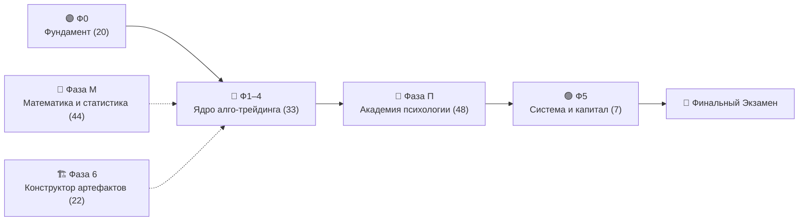

# 🚀 КриптоНавигатор

> **Интерактивный тренажёр и обучающая экосистема, которая превращает новичка в дисциплинированного оператора торгового бота и квант-исследователя — без единой строчки кода и без риска реальными деньгами.**

Это не курс «смотри и слушай». Это **автономное приложение-симулятор** (`index.html`, чистый HTML/CSS/JS, ноль установки, ноль сторонних фреймворков), где ты с самого начала *делаешь*: кликаешь, рассчитываешь риски, ошибаешься в безопасной песочнице, проходишь квалификационные аттестации и выращиваешь привычки, которые удержат тебя от дорогих ошибок на живом рынке.

---

## 🎯 Для кого

- **Абсолютный новичок**, который хочет безопасно разобраться в криптовалютах, блокчейне и алгоритмическом трейдинге.
- **Самоучка**, который уже «торговал руками», испытал эмоциональные срывы или слил депозит — и хочет понять *почему* и как выстроить систему.
- **Будущий оператор торгового бота**, который хочет, чтобы машина работала по жесткому регламенту, а он — спокойно спал.

Не для тех, кто ищет «сигналы» и «+400% за неделю». Здесь учат **не терять капитал**, мыслить вероятностями и математическим ожиданием, прежде чем выходить на реальный рынок.

---

## 📊 Курс в цифрах

| Метрика | Значение |
|---|---|
| 📚 **Всего уроков** | **174** (60 основных + 22 бонусных + 44 математики + **48 психологии и риск-инженерии**) |
| 🗺️ **Фаз обучения** | **9** (Фазы 0–6 + Фаза М (Математика) + **Фаза П (Психология)**) |
| 🧩 **Интерактивных виджетов и симуляторов** | **185** встроенных в уроки (включая Монте-Карло, стакан, ликвидации, дельта-нейтрал) |
| 🧠 **Психологических тренажёров** | **48** интерактивных тренажёров (по одному на каждый урок П1–П48) |
| ❓ **Банк ситуационных тестов самопроверки** | **144** гарвардских бизнес-кейса (по 3 на каждый урок П1–П48) |
| 🏗️ **Конструкторов рыночных артефактов** | **8** (создай токен, стейблкоин, NFT, DAO, оракул, торгового бота и др.) |
| 🌍 **Живой рынок с наставником** | 6 источников данных, 12 детерминированных детекторов |
| 📰 **Новости-наставник** | 5 RSS-лент, классификатор 7 типов, 3 когнитивных упражнения |
| 📖 **Терминов в глоссарии** | **205** с примерами и жизненными аналогиями |
| 🏆 **Квалификационных аттестаций** | **9** (по каждой фазе с порогом 80%) |
| 🎮 **Мини-игр и тренажеров** | **21** (18 игровых симуляторов + 3 отдельные игры) |
| 📦 **Автономность** | Один файл `index.html`, работает 100% офлайн без интернета |
| ☁️ **SaaS-платформа** | Cloudflare Workers API + KV + R2 контент-паки с Brotli-сжатием |

---

## 🗺️ Программа: 9 фаз от «что такое деньги» до «я управляю капиталом»

Каждая фаза — это структурированный набор уроков с квизами, практическими симуляторами и обязательной аттестацией. Прогресс сохраняется в браузере и синхронизируется с облаком.



### 🟣 Фаза 0 — Фундамент финансовой грамотности (20 уроков)
База до трейдинга: природа денег, инфляция, риск и доходность, блокчейн, почему ручной трейдинг проигрывает системе, устройство бирж и кошельков.

### 🔵 Фазы 1–4 — Ядро количественного трейдинга (33 урока)
- **Фаза 1:** Research Pipeline, стационарность рядов, толстые хвосты, Look-ahead bias, Walk-Forward анализ.
- **Фаза 2:** Поиск статистического эджа, ончейн-аналитика, стакан заявок (OBI, CVD, спуфинг), воронка квант-исследований.
- **Фаза 3:** Портфельная теория, коинтеграция, парный арбитраж, риск-менеджмент, формула Келли и Value at Risk.
- **Фаза 4:** Инфраструктура, WebSockets, архитектура торгового бота, P2P, налоги и соблюдение 115-ФЗ.

### 🟢 Фаза 5 — Система и живой капитал (7 уроков)
Сборка системы воедино: торговый устав, бэктест, журнал сделок, запуск на реальные средства и регулярный аудит.

### 🏗️ Фаза 6 — Конструктор крипто-артефактов (22 урока)
Внутренняя механика Web3: токены, алгоритмические стейблкоины, NFT, механизмы голосования DAO, децентрализованные оракулы. Включает 8 интерактивных конструкторов.

### 🧮 Фаза М — Математика и теория вероятностей (44 урока)
Матожидание, дисперсия, распределение Гаусса против степенных законов, байесовское обновление вероятностей, симуляции Монте-Карло — наглядные ползунки без сложных академических формул.

---

## 🧠 Фаза П — Академия психологии и риск-инженерии (48 уроков, П1–П48)

Главный риск любой системы — её владелец. Этот блок объединяет 8 базовых уроков управления ботом и 40 уроков по идеям и методикам из **14 фундаментальных мировых бестселлеров** по психологии трейдинга, нейроэкономике и науке о рисках (*Jared Tendler, Tom Hougaard, Mark Douglas, Mark Minervini, Brett Steenbarger, Nassim Taleb, David Spiegelhalter, Morgan Housel, Daniel Crosby, Gary Edward, Jason Zweig, Jack Schwager, Brett Goldstein, Александр Могилат*).

Блок состоит из **7 специализированных модулей**, **48 интерактивных тренажеров** и **144 ситуационных задач самопроверки**:

```mermaid
graph TD
    M1["🟢 Модуль 1: Базовая дисциплина бота<br/>(П1–П8: ночные алерты, доверие, эйфория, премортем)"]
    M2["🧠 Модуль 2: Нейробиология мозга<br/>(П9–П19: дофамин, боль инсулы, 5 видов тильта, MHH)"]
    M3["🎲 Модуль 3: Вероятностное мышление<br/>(П20–П25: истины Дугласа, миры Талеба, ловушка индейки)"]
    M4["🏆 Модуль 4: Психология чемпиона<br/>(П26–П30: термостат Минервини, Best Loser, Дюймовый червь)"]
    M5["🛠️ Модуль 5: Инженерия привычек<br/>(П31–П35: R-множители, взлом петли, саберметрика, режимы)"]
    M6["🏛️ Модуль 6: Философия состоятельности<br/>(П36–П40: автономия времени, Rich vs Wealthy, планка «Достаточно»)")"]
    M7["⚔️ Модуль 7: Проп-фонд и стресс-тесты<br/>(П41–П48: стресс-камера, синдром самозванца, риск-офицер, Манифест)"]
    M1 --> M2 --> M3 --> M4 --> M5 --> M6 --> M7
```

### 📋 Содержание 7 модулей Академии психологии:

1. **Модуль 1. Базовая дисциплина и управление ботом (Уроки П1–П8):** ночные алерты, шкала доверия машине, удары после побед, магия нуля, радионяня трейдера, детектор дофаминового зуда, письмо из будущего и судья торговых недель.
2. **Модуль 2. Нейробиология мозга и анатомия эмоций (Уроки П9–П19):** дофаминовый капкан, боль островковой доли, захват миндалины на обвале, батарея ментальной энергии, физиология спокойствия, аварийный стоп-тильт, 5 масок злости Тендлера, паралич кнопки, снайпер против пулеметчика, протокол MHH и декомпрессия стресса.
3. **Модуль 3. Вероятностное мышление и наука о риске (Уроки П20–П25):** 5 истин Марка Дугласа, истинное принятие риска, 100 миров Талеба, ошибка выжившего, ловушка индейки мартингейла и байесовская Brier-калибровка Кромвеля.
4. **Модуль 4. Психология чемпиона и безупречное исполнение (Уроки П26–П30):** ментальный термостат Минервини, парадокс лучшего неудачника Хоугаарда (3:1), Чек-лист Ясности, репетиция катастроф Pre-Mortem и модель Дюймового червя Тендлера.
5. **Модуль 5. Инженерия привычек и саберметрика (Уроки П31–П35):** мышление в R-множителях, взлом петли привычки Эдварда, саберметрический Process Score Стинбарджера, классификатор режимов рынка и Крепость капитала 40/40/20.
6. **Модуль 6. Философия состоятельности и автономия (Уроки П36–П40):** любительский теннис Мангера, богатый против состоятельного Хаузела, эксперимент со стоматологом Талеба, планка «Достаточно» и калькулятор покупки свободы времени.
7. **Модуль 7. Продвинутая практика, проп-фонд и социальная устойчивость (Уроки П41–П48):** лаборатория стресс-тестирования психики, управление крупным капиталом и синдром самозванца, социальное давление семьи и друзей, дневник когнитивных ловушек, паника запертой ликвидности в пустом стакане, внешний надзор риск-офицера проп-фонда, защита от выгорания 24/7 и Финальный Манифест Оператора.

---

## 🧪 Доказательные методики обучения

| Методика | Реализация в тренажёре |
|---|---|
| 🔄 **Интерливинг** | Смешанные сессии вопросов из разных фаз — тренируют распознавание рыночных паттернов |
| 🧘 **Консолидация NSDR** | Экран «тишины» после каждого урока с таймером и дыханием 4-4-6 для фиксации нейропластичности |
| 🗣️ **Метод Фейнмана** | Формулирование концепций своими словами с алгоритмической проверкой понятий |
| 🎯 **Active Recall 2.0** | Числовые и ситуационные задачи с открытым вводом и допуском точности |
| 📈 **Brier-калибровка** | Самооценка степени уверенности с расчетом Brier Score — разделяет знание от иллюзии |
| 📓 **Журнал когнитивных ошибок** | Фиксация персональных поведенческих ловушек в одном месте |
| 🧩 **SM-2 интервальные повторения** | Контрольные сборочные пункты каждые 5 уроков |
| 🔀 **Детерминированное перемешивание** | Варианты ответов перемешиваются ГСЧ — невозможно вызубрить позицию ответа |

---

## 🕹️ Квант-викторина и тесты самопроверки

В платформу встроен тренажер самопроверки с 6 специализированными режимами:
1. `⚡ Блиц по терминам` — скоростная проверка понятийного аппарата (205 терминов).
2. `🧠 Практические квант-кейсы` — решение прикладных задач алготрейдинга и бэктестинга.
3. `⚖️ Законы, 115-ФЗ и Налоги` — проверка юридической и налоговой безопасности.
4. `🧮 Расчётные задачи` — вычисление Келли, матожидания, плеча, комиссионного трения.
5. `📊 Гипотезы из данных` — проверка на переобучение, стационарность и утечки данных.
6. `🧘 Психология и риск-контроль (144 кейса)` — решение глубоких психологических кейсов по всем 48 урокам Фазы П.

---

## 🛠️ Запуск и техническое устройство

### Локальная автономная версия (`index.html`)
- **Один файл** — никаких внешних зависимостей, npm-пакетов или серверов.
- **Чистый JavaScript** — нативный браузерный стек, адаптивный дизайн для ПК и смартфонов.
- **100% приватность** — все данные и прогресс сохраняются в локальном `localStorage` браузера.

Запуск в один клик: просто откройте `index.html` в браузере (Chrome, Edge, Firefox, Safari) или поднимите локальный сервер:
```bash
python -m http.server 8000
# → http://localhost:8000/index.html
```

### SaaS-платформа на Cloudflare Workers (`saas/`)
- Беспарольная аутентификация по Magic Link / JWT.
- Автоматическая двусторонняя синхронизация прогресса с локальным хранилищем.
- Модульный контент-конвейер: контент автоматически экстрагируется в оптимизированные Brotli-паки (до 48.7 КБ) и распределяется через Cloudflare R2 и KV без необходимости передеплоя воркера.

---

## ⚠️ Дисклеймер

Платформа «КриптоНавигатор» является **образовательным тренажёром**. Все симуляции, расчеты и упражнения выполняются на учебных виртуальных данных. Материалы платформы не являются индивидуальной инвестиционной или финансовой рекомендацией. Реальная торговля сопряжена с высоким риском потери капитала. Курс учит **культуре риска, дисциплине и инженерному процессу**.

---

**Готов перестать быть пассажиром собственных денег? Открывай `index.html` — Фаза 0 и Академия психологии ждут.** 🚀
